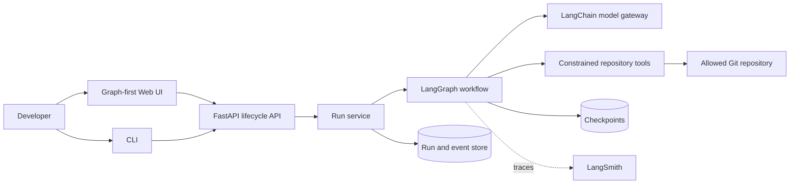
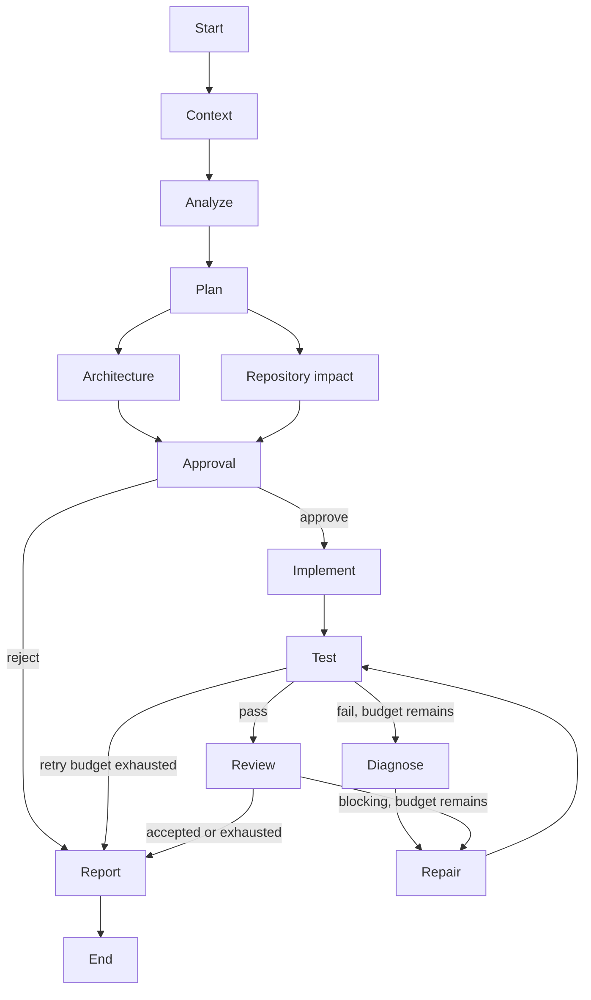

# TaskPilot AI

> A human-governed, graph-based orchestrator for planning, implementing, validating, and reviewing software changes.

[](https://github.com/chasesaurabh/taskpilot-ai/actions/workflows/ci.yml)

TaskPilot AI turns a repository-scoped engineering request into an observable, resumable delivery workflow. LangChain supplies model and tool abstractions; LangGraph supplies the explicit state machine, branching, retries, interrupts, checkpointing, and streaming.

## Project status

TaskPilot AI is under active construction. The architecture and quality foundation are in place; executable workflow milestones are tracked in the [roadmap](#roadmap). Capabilities are documented as implemented only when they are covered by tests.

## Why this exists

Coding agents are useful, but unconstrained model/tool loops are difficult to operate safely. Engineering work needs deterministic boundaries around probabilistic behavior: visible plans, bounded tools, approval gates, validation, retry limits, durable state, and an audit trail. TaskPilot AI makes those controls first-class product concepts.

## Planned capabilities

- Typed LangGraph workflow with parallel analysis and conditional repair loops
- Human approval that survives process restarts
- Constrained repository read, write, and command tools
- OpenAI, Anthropic, OpenAI-compatible, local, and deterministic demo models
- FastAPI lifecycle API with replayable Server-Sent Events
- Typer CLI and a graph-first React interface
- SQLite local persistence and PostgreSQL production configuration
- Structured logs, per-run correlation IDs, and optional LangSmith tracing
- Deterministic test and evaluation scenarios that require no paid model

## Architecture





See [Architecture](docs/architecture.md) for boundaries, state ownership, execution semantics, and tradeoffs.

## Quick start

Executable setup instructions will land with the graph and API milestones. The intended local experience is:

```bash
cp .env.example .env
uv sync --all-extras
uv run taskpilot-api
uv run taskpilot run --repo ./examples/sample-api \
  --task "Add pagination to the products endpoint and update tests"
```

The no-key demo model will exercise success, repair, rejection, resume, and retry-exhaustion scenarios without pretending to be a production model.

## Configuration

Configuration is environment-driven with an optional YAML policy file. See [.env.example](.env.example) and [config.example.yaml](config.example.yaml). Secrets must be passed through the environment and must never be committed.

## Security model

TaskPilot AI is a developer tool, not a secure sandbox for hostile repositories. Its default tool layer will enforce configured repository roots, canonical path checks, symlink and traversal defenses, command allowlists, timeouts, output limits, and separate read/write/execute permissions. Strong isolation requires running workers in disposable containers or VMs.

## Documentation

- [Architecture](docs/architecture.md)
- [Why LangGraph](docs/adr/001-why-langgraph.md)
- [State and checkpoint design](docs/adr/002-state-and-checkpoint-design.md)
- [Human-in-the-loop policy](docs/adr/003-human-in-the-loop-policy.md)
- [Model provider abstraction](docs/adr/004-model-provider-abstraction.md)
- [Repository tool security](docs/adr/005-repository-tool-security.md)
- [Streaming strategy](docs/adr/006-streaming-strategy.md)

## Development

```bash
uv sync --all-extras
uv run ruff format --check .
uv run ruff check .
uv run mypy src
uv run pytest
```

See [CONTRIBUTING.md](CONTRIBUTING.md) for workflow and commit conventions.

## Limitations

- The foundation milestone does not yet execute workflows.
- The initial runtime targets one trusted developer per installation, not multi-tenant isolation.
- Repository commands are processes on the host unless an external sandbox is configured.
- Provider behavior and structured-output quality vary; capability checks and fallbacks cannot eliminate that variance.

## Roadmap

1. Foundation and architecture
2. Typed graph and deterministic routing
3. Constrained repository tools
4. Model abstraction and routing
5. Implementation, validation, and repair
6. Approval, checkpoints, and resume
7. API and SSE
8. CLI and evaluation scenarios
9. Graph-first web UI
10. Observability, PostgreSQL, Docker, and sample app
11. CI, security hardening, and documentation polish

## License

Licensed under the [Apache License 2.0](LICENSE).
