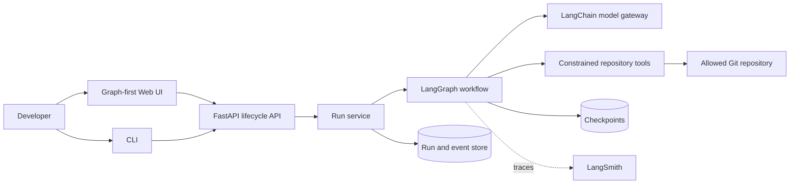
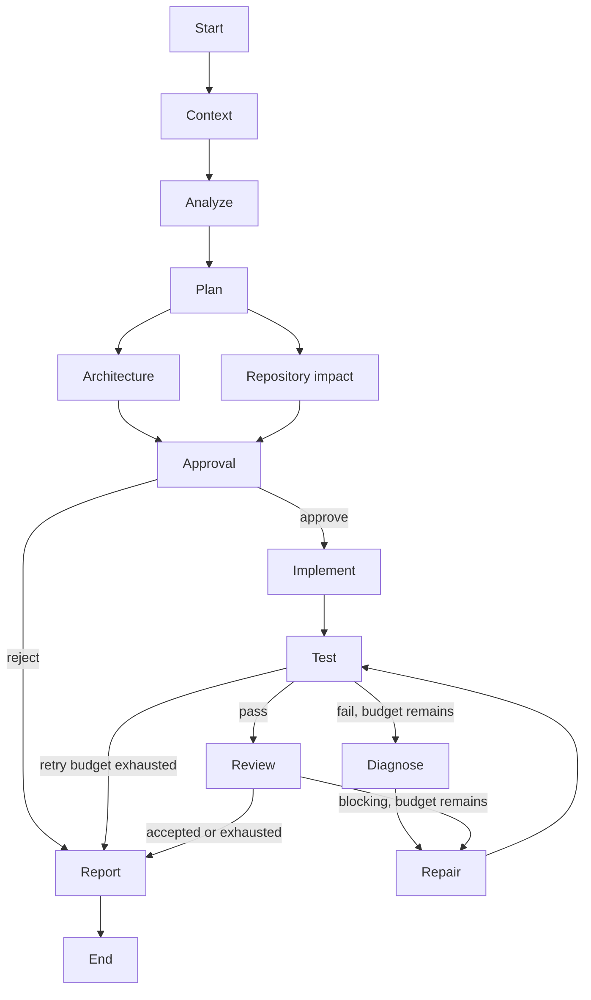

# TaskPilot AI

> A human-governed, graph-based orchestrator for planning, implementing, validating, and reviewing software changes.

[](https://github.com/chasesaurabh/taskpilot-ai/actions/workflows/ci.yml)

TaskPilot AI turns a repository-scoped engineering request into an observable, resumable delivery workflow. LangChain supplies model and tool abstractions; LangGraph supplies the explicit state machine, branching, retries, interrupts, checkpointing, and streaming.

## Project status

TaskPilot AI is under active construction. The core workflow, durable approval, API, SSE, CLI, and graph-first web interface are implemented and tested. Deployment packaging remains in progress; see the [roadmap](#roadmap).

## Why this exists

Coding agents are useful, but unconstrained model/tool loops are difficult to operate safely. Engineering work needs deterministic boundaries around probabilistic behavior: visible plans, bounded tools, approval gates, validation, retry limits, durable state, and an audit trail. TaskPilot AI makes those controls first-class product concepts.

## Capabilities

- **Implemented:** typed LangGraph workflow, parallel analysis, conditional repair loops, retry exhaustion, constrained repository operations, provider-neutral structured models, explicit routing, native human interrupts, durable SQLite checkpoints, restart-safe resume, lifecycle API, replayable SSE, deterministic no-key model, installable CLI, repeatable evaluation scenarios, and a responsive graph-first React interface.
- **Next:** structured observability, PostgreSQL support, Docker packaging, and a runnable sample repository.
- **Planned:** CI, security hardening, and release documentation.

## Architecture





See [Architecture](docs/architecture.md) for boundaries, state ownership, execution semantics, and tradeoffs.

## Quick start

Executable setup instructions will land with the graph and API milestones. The intended local experience is:

```bash
cp .env.example .env
uv sync --all-extras
uv run taskpilot-api
uv run taskpilot run --repo ./examples/sample-api \
  --task "Add pagination to the products endpoint and update tests"
```

The no-key demo model will exercise success, repair, rejection, resume, and retry-exhaustion scenarios without pretending to be a production model.

## CLI

```bash
taskpilot run \
  --repo ./examples/sample-api \
  --task "Add pagination to the products endpoint and update tests"
```

Use `--approval ask` for an interactive gate, `--approval approve` for a trusted demo, or `--approval stop` to leave the durable run waiting. A stopped run can be resumed from any client:

```bash
taskpilot approve <run-id> --actor you@example.com
taskpilot reject <run-id> --reason "Revise the data migration approach"
taskpilot status <run-id>
taskpilot events <run-id> --after 12
```

Representative output:

```text
✓ Repository context gathered
✓ Change analyzed
✓ Implementation plan created
✓ Architecture review completed

⏸ Human approval required

✓ Implementation completed
✓ Validation completed
✓ Code review completed
✓ Final report generated
```

## API lifecycle

The versioned FastAPI contract separates commands from observation:

```text
POST /runs
GET  /runs/{run_id}
GET  /runs/{run_id}/events     # SSE; honors Last-Event-ID
POST /runs/{run_id}/approve
POST /runs/{run_id}/reject
```

Events are persisted before publication. Reconnecting clients can replay missed events by sequence, while compare-and-set status changes prevent duplicate approval from resuming a run twice.

## Web interface

The React application treats the workflow graph as the primary control surface. It streams run events, shows each node's status, exposes model and validation metadata in an inspector, and presents approval or rejection controls when the graph pauses.

```bash
pnpm install
pnpm --filter @taskpilot/web dev
```

Set `VITE_API_URL` when the lifecycle API is not available at `http://localhost:8000`.

## Configuration

Configuration is environment-driven with an optional YAML policy file. See [.env.example](.env.example) and [config.example.yaml](config.example.yaml). Secrets must be passed through the environment and must never be committed.

## Security model

TaskPilot AI is a developer tool, not a secure sandbox for hostile repositories. Its default tool layer will enforce configured repository roots, canonical path checks, symlink and traversal defenses, command allowlists, timeouts, output limits, and separate read/write/execute permissions. Strong isolation requires running workers in disposable containers or VMs.

## Documentation

- [Architecture](docs/architecture.md)
- [Evaluation scenarios](docs/evaluations.md)
- [Why LangGraph](docs/adr/001-why-langgraph.md)
- [State and checkpoint design](docs/adr/002-state-and-checkpoint-design.md)
- [Human-in-the-loop policy](docs/adr/003-human-in-the-loop-policy.md)
- [Model provider abstraction](docs/adr/004-model-provider-abstraction.md)
- [Repository tool security](docs/adr/005-repository-tool-security.md)
- [Streaming strategy](docs/adr/006-streaming-strategy.md)

## Development

```bash
uv sync --all-extras
uv run ruff format --check .
uv run ruff check .
uv run mypy src
uv run pytest
pnpm --filter @taskpilot/web format:check
pnpm --filter @taskpilot/web lint
pnpm --filter @taskpilot/web test
pnpm --filter @taskpilot/web build
```

See [CONTRIBUTING.md](CONTRIBUTING.md) for workflow and commit conventions.

## Limitations

- The graph, API application factory, CLI, and web interface are implemented; the packaged API runtime entry point is not yet available.
- The initial runtime targets one trusted developer per installation, not multi-tenant isolation.
- Repository commands are processes on the host unless an external sandbox is configured.
- Provider behavior and structured-output quality vary; capability checks and fallbacks cannot eliminate that variance.

## Roadmap

1. Foundation and architecture
2. Typed graph and deterministic routing
3. Constrained repository tools
4. Model abstraction and routing
5. Implementation, validation, and repair
6. Approval, checkpoints, and resume
7. API and SSE
8. CLI and evaluation scenarios
9. Graph-first web UI
10. Observability, PostgreSQL, Docker, and sample app
11. CI, security hardening, and documentation polish

## License

Licensed under the [Apache License 2.0](LICENSE).
