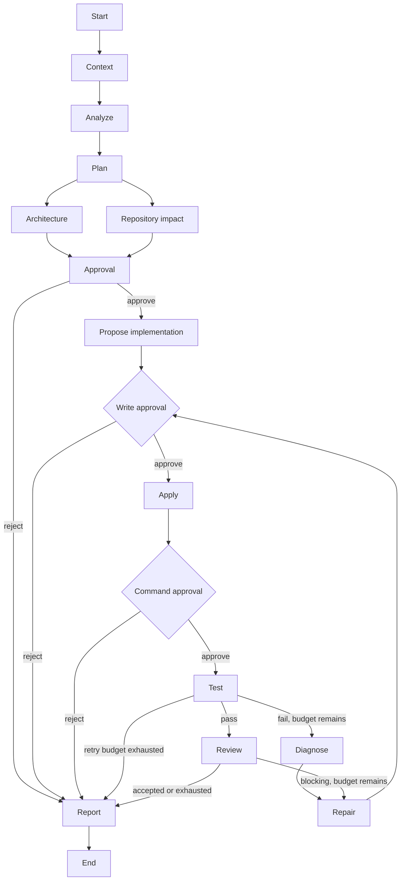

# TaskPilot AI

## Agentic Software Delivery Orchestrator

[](https://github.com/chasesaurabh/taskpilot-ai/actions/workflows/ci.yml)
[](https://github.com/chasesaurabh/taskpilot-ai/actions/workflows/codeql.yml)
[](https://pypi.org/project/taskpilot-ai/)
[](https://www.python.org/downloads/)


TaskPilot turns a repository-scoped engineering request into a visible, human-governed delivery
workflow. LangGraph owns orchestration and durability, LangChain owns provider-neutral prompts and
structured model calls, and TaskPilot owns policy and constrained side effects.

## Quick start

The Docker Compose demo builds the API and web UI, starts PostgreSQL, and runs without a model key:

```bash
docker compose up --build
```

Open `http://localhost:5173`, start the prefilled pagination task, review the plan, approve it, and
watch implementation, subprocess validation, review, and reporting complete.

Install the CLI and API entry points from PyPI:

```bash
python -m pip install taskpilot-ai
taskpilot --help
```

Published releases also include provenance-attested API and web images. See the
[latest release](https://github.com/chasesaurabh/taskpilot-ai/releases/latest) and
[publishing guide](docs/publishing.md) for versioned image names and attestation verification.

## Use TaskPilot on your repository

The default Compose stack is an isolated deterministic demo. To work on a repository on your
machine, create ignored local configuration and use the repository overlay:

```bash
mkdir -p .taskpilot
cp config.live.example.yaml .taskpilot/config.yaml
cp .env.example .env
# Set TASKPILOT_REPOSITORY_PATH and the provider key in .env.
# Select models and safe validation commands in .taskpilot/config.yaml.
docker compose -f docker-compose.yml -f docker-compose.repository.yml up --build
```

Start from a clean branch and inspect the resulting `git diff`. The
[repository guide](docs/use-your-repository.md) includes PowerShell commands, Linux file ownership,
provider setup, toolchain constraints, and troubleshooting.

## How it works

- Typed state and deterministic routes keep workflow policy outside model prompts.
- Architecture and repository-impact analysis run concurrently and join before plan approval.
- Optional write and command gates disclose each enabled side effect before it occurs.
- Repository writes use hash preconditions, transactional batches, and persisted operation IDs.
- Validation uses shell-free argument vectors, allowlists, timeouts, and output limits.
- Failed validation or blocking review enters a bounded diagnose, repair, and retest loop.
- Checkpoints, run projections, and replayable SSE preserve execution across restarts.




## Interfaces

For direct local development, start the API and web app in separate terminals:

```bash
cp .env.example .env
uv sync --all-extras
uv run taskpilot-api
```

```bash
pnpm install
pnpm --filter @taskpilot/web dev
```

With the API running, start the deterministic sample task from the CLI:

```bash
taskpilot run \
  --repo ./examples/sample-api \
  --task "Add pagination to the products endpoint and update tests"
```

Use `--approval ask` for an interactive gate, `--approval approve` for a trusted demo, or
`--approval stop` to leave the durable run waiting. Any client can resume a waiting run:

```bash
taskpilot approve <run-id> --actor you@example.com
taskpilot reject <run-id> --reason "Revise the data migration approach"
taskpilot status <run-id>
taskpilot events <run-id> --after 12
```

The FastAPI lifecycle separates commands from observation:

```text
POST /runs
GET  /runs
GET  /model-profiles
GET  /runs/{run_id}
GET  /runs/{run_id}/events
GET  /runs/{run_id}/artifacts/{artifact_id}
POST /runs/{run_id}/approve
POST /runs/{run_id}/reject
```

The React interface presents the graph as the primary control surface, streams run events, exposes
model and validation evidence, and shows approval controls whenever the graph pauses.

## Configuration and models

Configuration comes from environment variables and an optional YAML policy. Start with
[`.env.example`](.env.example) and [`config.example.yaml`](config.example.yaml); keep secrets in the
environment, never in YAML.

| Concern       | Controls                                                                        |
| ------------- | ------------------------------------------------------------------------------- |
| Repository    | Allowed roots, context/file limits, writes, commands, and validation allowlists |
| Workflow      | Plan, write, and command approvals; maximum repair attempts                     |
| Models        | Provider definitions, complete role profiles, and ordered routing rules         |
| Persistence   | SQLite or PostgreSQL checkpoints, runs, events, operations, and artifacts       |
| Access        | Local mode, opaque bearer-token principals, or OIDC identities and roles        |
| Execution     | Embedded orchestration or leased workers; host or container validation          |
| Observability | Structured logs and opt-in LangSmith tracing                                    |

Supported model backends are the deterministic demo, OpenAI, Anthropic, hosted OpenAI-compatible
endpoints, and local OpenAI-compatible inference. Profiles assign all six roles—analyst, planner,
architect, coder, reviewer, and reporter—and are selected through the web UI, API, or CLI. TaskPilot
validates profiles and required environment values at startup and persists the selected profile with
the run.

See [`config.example.yaml`](config.example.yaml) for all policy fields and
[live-model validation](docs/live-model-validation.md) for provider examples and opt-in integration
tests.

## Deployment and security

Local mode requires no authentication. Shared deployments can use owner-scoped opaque tokens or
OIDC identities with approval and administrator roles. Full patches and validation logs can be
stored locally or in S3-compatible object storage, and graph execution can be split from API
replicas through leased workers.

Validation runs on the host by default. The optional container backend runs each allowed command
without network access or Linux capabilities and applies CPU, memory, PID, and temporary-filesystem
limits. TaskPilot is still a developer tool rather than a security boundary for hostile tenants;
whole-service isolation and careful repository, identity, secret, and storage controls remain the
operator's responsibility.

See [deployment and isolation](docs/deployment.md) and the [security policy](SECURITY.md) before a
shared or production deployment.

## Evaluation and development

Run the deterministic quality suite:

```bash
uv sync --all-extras
uv run ruff format --check .
uv run ruff check .
uv run mypy src
uv run pytest
pnpm install
pnpm --filter @taskpilot/web format:check
pnpm --filter @taskpilot/web lint
pnpm --filter @taskpilot/web test
pnpm --filter @taskpilot/web build
```

Run a checked-in or private evaluation dataset against a configured model profile:

```bash
taskpilot evaluate evaluations/datasets/demo-pagination.yaml
```

The ordinary test suite is credential-free. PostgreSQL, S3-compatible storage, container execution,
and live-provider tests are enabled only by their documented environment variables. See
[evaluation scenarios](docs/evaluations.md) and [CONTRIBUTING.md](CONTRIBUTING.md).

## Documentation

- [Architecture](docs/architecture.md) and [LangGraph/LangChain design](docs/langgraph-design.md)
- [Use TaskPilot on your repository](docs/use-your-repository.md)
- [Authentication, artifacts, workers, and isolated execution](docs/deployment.md)
- [Live-model validation](docs/live-model-validation.md) and
  [evaluation scenarios](docs/evaluations.md)
- [Publishing releases](docs/publishing.md) and [self-hosted runner operations](docs/self-hosted-runner.md)
- [Architecture decision records](docs/adr/), [changelog](CHANGELOG.md), and
  [security policy](SECURITY.md)

## License

Licensed under the [Apache License 2.0](LICENSE).
