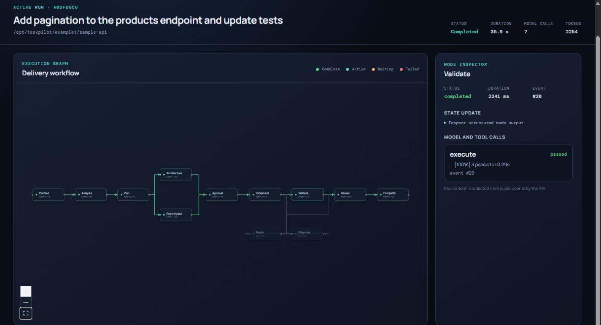
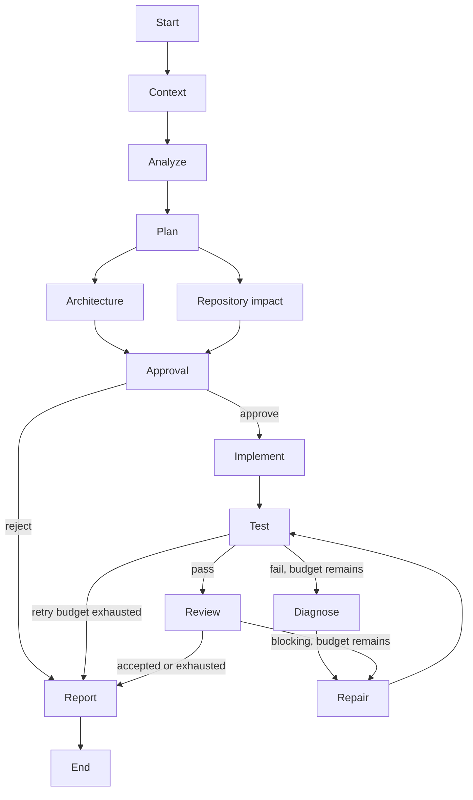
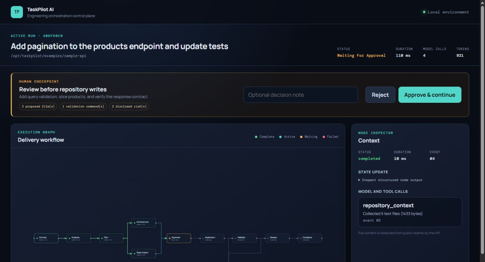
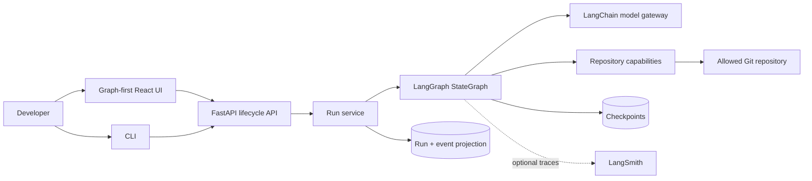

# TaskPilot AI

## Agentic Software Delivery Orchestrator

[](https://github.com/chasesaurabh/taskpilot-ai/actions/workflows/ci.yml)
[](https://github.com/chasesaurabh/taskpilot-ai/actions/workflows/codeql.yml)



TaskPilot turns a repository-scoped engineering request into a visible, human-governed delivery
workflow. **LangGraph owns orchestration and durability. LangChain owns provider-neutral prompts and
structured model calls. TaskPilot owns policy and constrained side effects.**

```bash
docker compose up --build
```

Open `http://localhost:5173`, start the prefilled task, inspect the parallel analysis, approve the
plan, and watch implementation, real subprocess validation, review, and the final report. No model
key is required for this deterministic portfolio path.

## Use TaskPilot on your repository

The default Compose stack remains an isolated, no-key demo. To run against a repository on your
machine, create ignored local configuration and use the repository overlay:

```bash
mkdir -p .taskpilot
cp config.live.example.yaml .taskpilot/config.yaml
cp .env.example .env
# Edit .env: set TASKPILOT_REPOSITORY_PATH to an absolute path and add the provider key.
# Edit .taskpilot/config.yaml: select models and safe validation commands for that repository.
docker compose -f docker-compose.yml -f docker-compose.repository.yml up --build
```

Open `http://localhost:5173`; the form is prefilled with the mounted path
`/workspace/repository`. TaskPilot writes through the bind mount only after approval, so start from
a clean branch and review the resulting `git diff`. See
[Use TaskPilot on your repository](docs/use-your-repository.md) for PowerShell commands, Linux file
ownership, provider setup, toolchain constraints, and troubleshooting.

## Why this is more than a coding-agent loop

- **Deterministic orchestration around probabilistic AI:** typed partial state, explicit routes, and
  a bounded repair budget—not a model deciding when it is done.
- **Human governance:** a native persisted `interrupt()` discloses files, commands, findings, and
  risks before writes; `Command(resume=…)` continues the same saved thread.
- **Durable and observable execution:** SQLite/PostgreSQL checkpoints are separate from the run/event
  projection used by replayable SSE, the CLI, and the graph-first UI.
- **Constrained effects:** application-owned hash preconditions, atomic writes, no general shell,
  allowlisted argument vectors, stripped command environments, timeouts, and output limits.
- **Evidence-driven recovery:** validation and blocking review findings route through a real,
  bounded diagnosis/repair/retest loop.

## Delivery graph



Architecture and repository-impact analysis execute concurrently and join before approval. Routing
functions inspect typed evidence; they never ask a model where the workflow should go.



## System architecture



See [Architecture](docs/architecture.md) and
[LangGraph and LangChain design](docs/langgraph-design.md) for state ownership, framework boundaries,
and the exact source modules behind each capability.

## Demo and real models

The no-key model intentionally implements one exact task:

```text
Add pagination to the products endpoint and update tests
```

For OpenAI, Anthropic, hosted OpenAI-compatible endpoints, or local OpenAI-compatible inference, use
the [opt-in live-model validation](docs/live-model-validation.md). Two scenarios exercise the same
full API and graph and emit model selection, graph path, tools, files, validation, retry, token, and
duration evidence. Live-provider tests never run in ordinary CI and were not executed in the
credential-free release-review environment.

For direct development:

```bash
cp .env.example .env
uv sync --all-extras
uv run taskpilot-api                              # terminal 1
pnpm install && pnpm --filter @taskpilot/web dev # terminal 2
```

## CLI

```bash
taskpilot run \
  --repo ./examples/sample-api \
  --task "Add pagination to the products endpoint and update tests" \
  --model-profile balanced
```

Use `--approval ask` for an interactive gate, `--approval approve` for a trusted demo, or `--approval stop` to leave the durable run waiting. A stopped run can be resumed from any client:

```bash
taskpilot approve <run-id> --actor you@example.com
taskpilot reject <run-id> --reason "Revise the data migration approach"
taskpilot status <run-id>
taskpilot events <run-id> --after 12
```

Representative output:

```text
✓ Repository context gathered
✓ Change analyzed
✓ Implementation plan created
✓ Architecture review completed

⏸ Human approval required

✓ Implementation completed
✓ Validation completed
✓ Code review completed
✓ Final report generated
```

## API lifecycle

The FastAPI lifecycle contract separates commands from observation:

```text
POST /runs
GET  /model-profiles
GET  /runs/{run_id}
GET  /runs/{run_id}/events     # SSE; honors Last-Event-ID
POST /runs/{run_id}/approve
POST /runs/{run_id}/reject
```

Events are persisted before publication. Reconnecting clients can replay missed events by sequence, while compare-and-set status changes prevent duplicate approval from resuming a run twice.

## Web interface

The React application treats the workflow graph as the primary control surface. It streams run events, shows each node's status, exposes model, token, tool, validation, and timing metadata in an inspector, and presents approval or rejection controls when the graph pauses.

```bash
pnpm install
pnpm --filter @taskpilot/web dev
```

Set `VITE_TASKPILOT_API_URL` to the API base when the Vite development proxy is not used.

## Configuration

Configuration is environment-driven with an optional YAML policy file. See [.env.example](.env.example) and [config.example.yaml](config.example.yaml). Secrets must be passed through the environment and must never be committed.

The committed example is cloud-only: it demonstrates native OpenAI and Anthropic providers, a
hosted OpenAI-compatible provider, and both mixed-provider and OpenAI-only profiles. Keep
machine-specific endpoints in an ignored policy file rather than adding them to a tracked example.

| Concern | Environment/YAML control |
| --- | --- |
| Runtime | host, port, environment, demo mode |
| Persistence | SQLite paths or PostgreSQL connection URLs |
| Repository | allowed roots, file/context/output limits, write/execute capabilities |
| Commands | argument-prefix allowlist, default validation commands, and timeout |
| Workflow | plan approval requirement and maximum repair attempts |
| Models | named profiles, provider definitions/options, role assignments, ordered routing rules |
| Observability | JSON log level and opt-in LangSmith tracing |

## Model providers and routing

| Provider | Configuration | Status |
| --- | --- | --- |
| Deterministic demo | `TASKPILOT_DEMO_MODE=true` | Implemented for the bundled pagination scenario |
| OpenAI | `provider: openai` plus `OPENAI_API_KEY` | Implemented through LangChain |
| Anthropic | `provider: anthropic` plus `ANTHROPIC_API_KEY` | Implemented through LangChain |
| OpenAI-compatible | `provider: openai-compatible` plus `base_url` | Implemented; endpoint must support structured output |
| Local inference | `provider: local`, `base_url`, and `local: true` | Implemented through an OpenAI-compatible endpoint |

An OpenAI-compatible profile needs only a model name, endpoint, and environment-backed key:

```yaml
models:
  compatible-coder:
    provider: openai-compatible
    model: provider-model-name
    base_url: https://provider.example.com/v1
    api_key_env: COMPATIBLE_API_KEY
    structured_output_method: json_schema
    structured_output_strict: false

routing:
  default_profile: balanced
  profiles:
    balanced:
      assignments:
        analyst: compatible-coder
        planner: compatible-coder
        architect: compatible-coder
        coder: compatible-coder
        reviewer: compatible-coder
        reporter: compatible-coder
```

For a keyless local endpoint, use `provider: local` and `local: true`; omit `api_key_env`. Omitting
`max_tokens` lets the server apply its own generation limit. The model context window and the
generation-token limit are separate controls: TaskPilot still bounds repository context through
`repository.max_context_bytes`.

Profiles are validated at startup and may be selected through the web UI, API `model_profile`
field, or CLI `--model-profile`. The selected profile is persisted with the run, survives
checkpoint resume, and appears in model-decision telemetry. Optional `max_tokens`,
`organization_env`, `headers_from_env`, and `extra_body` fields cover common compatible-provider
requirements without placing secrets in YAML. Every configured profile must assign all six roles
and every endpoint must support the structured-output behavior used by LangChain.

Routing remains ordered and deterministic. See [ADR 004](docs/adr/004-model-provider-abstraction.md)
and [ADR 008](docs/adr/008-model-profiles-and-provider-options.md).

## Observability

The API writes structured JSON logs with request or run correlation IDs. Its durable event stream distinguishes graph-node, model, repository-tool, approval, and terminal events. LangSmith tracing is opt-in via `TASKPILOT_LANGSMITH_ENABLED`; application state and logs remain authoritative when tracing is disabled.

## Security model

TaskPilot AI is a developer tool, not a secure sandbox for hostile repositories. Its default tool layer enforces configured repository roots, canonical path checks, symlink and traversal defenses, command allowlists, timeouts, output limits, and separate read/write/execute permissions. Strong isolation requires running workers in disposable containers or VMs.

## Documentation

- [Architecture](docs/architecture.md)
- [LangGraph and LangChain design](docs/langgraph-design.md)
- [Evaluation scenarios](docs/evaluations.md)
- [Self-hosted GitHub Actions runner](docs/self-hosted-runner.md)
- [Live-model validation](docs/live-model-validation.md)
- [Use TaskPilot on your repository](docs/use-your-repository.md)
- [Why LangGraph](docs/adr/001-why-langgraph.md)
- [State and checkpoint design](docs/adr/002-state-and-checkpoint-design.md)
- [Human-in-the-loop policy](docs/adr/003-human-in-the-loop-policy.md)
- [Model provider abstraction](docs/adr/004-model-provider-abstraction.md)
- [Repository tool security](docs/adr/005-repository-tool-security.md)
- [Streaming strategy](docs/adr/006-streaming-strategy.md)
- [Write-precondition ownership](docs/adr/007-write-precondition-ownership.md)
- [Model profiles and provider options](docs/adr/008-model-profiles-and-provider-options.md)
- [Demo capture guide](docs/demo.md)
- [Security policy](SECURITY.md)
- [v0.1.0 security review](docs/security-review.md)
- [Dependency review](docs/dependency-review.md)
- [v0.1.0 release notes](docs/releases/v0.1.0.md)
- [v0.1.0 release-readiness evidence](docs/release-readiness.md)
- [PyPI Trusted Publishing and GHCR release process](docs/publishing.md)
- [Changelog](CHANGELOG.md)

## Project structure

```text
apps/web/                 React, React Flow, SSE client, approval UI
src/taskpilot/api/        FastAPI transport and public schemas
src/taskpilot/application Run lifecycle and event normalization
src/taskpilot/graph/      Typed LangGraph topology and routing
src/taskpilot/nodes/      Engineering node responsibilities
src/taskpilot/models/     LangChain providers, routing, demo model
src/taskpilot/tools/      Constrained repository capabilities
src/taskpilot/persistence SQLite/PostgreSQL checkpoints, runs, events
src/taskpilot/observability Structured logging and LangSmith setup
examples/sample-api/      Writable FastAPI demonstration repository
tests/                    Unit, integration, routing, resume, API, CLI
docs/                     Architecture, ADRs, evaluations, demo guide
```

## Development

```bash
uv sync --all-extras
uv run ruff format --check .
uv run ruff check .
uv run mypy src
uv run pytest
pnpm --filter @taskpilot/web format:check
pnpm --filter @taskpilot/web lint
pnpm --filter @taskpilot/web test
pnpm --filter @taskpilot/web build
```

The backend suite is deterministic by default; `TASKPILOT_TEST_POSTGRES_URL` enables the PostgreSQL integration test. The five required behavior scenarios are mapped to concrete tests in [docs/evaluations.md](docs/evaluations.md). Run `uv run pre-commit install` to mirror the local formatting, lint, and typing checks before each commit.

See [CONTRIBUTING.md](CONTRIBUTING.md) for workflow and commit conventions. Focused issues and pull requests are welcome under the [Apache 2.0 license](LICENSE).

## Limitations

- Demo mode intentionally supports the bundled product-pagination task; use a configured model provider for arbitrary tasks.
- The plan is the only approval checkpoint; additional write/command gates are not implemented.
- The API has no built-in authentication; bind it to a trusted interface or use an authenticated reverse proxy.
- The initial runtime targets one trusted developer per installation, not multi-tenant isolation.
- Repository commands are processes on the host unless an external sandbox is configured.
- Provider behavior and structured-output quality vary; capability checks and fallbacks cannot eliminate that variance.

## Roadmap

- [x] Foundation, architecture, typed graph, tools, and model routing
- [x] Repair loops, approval interrupts, checkpoints, API/SSE, and CLI
- [x] Graph-first UI, observability, PostgreSQL, Docker, sample app, CI, and security guidance
- [ ] Authenticated multi-user deployments and isolated worker execution
- [ ] Object-store artifacts for long-lived full patches and validation logs
- [ ] Additional approval gates and model-backed evaluation datasets

## License

Licensed under the [Apache License 2.0](LICENSE).
