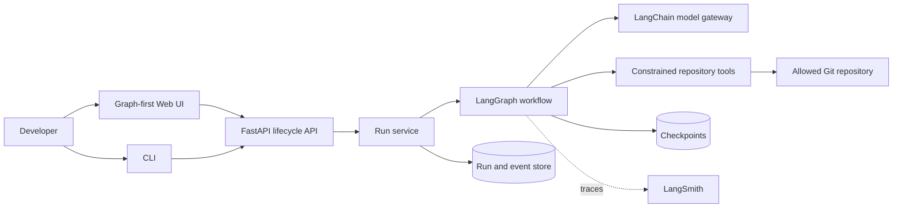
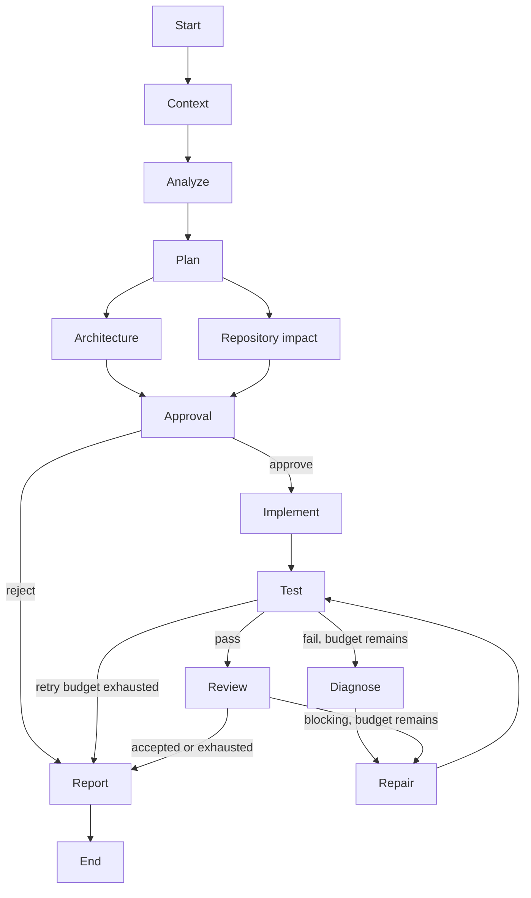

# TaskPilot AI

> A human-governed, graph-based orchestrator for planning, implementing, validating, and reviewing software changes.

[](https://github.com/chasesaurabh/taskpilot-ai/actions/workflows/ci.yml)

TaskPilot AI turns a repository-scoped engineering request into an observable, resumable delivery workflow. LangChain supplies model and tool abstractions; LangGraph supplies the explicit state machine, branching, retries, interrupts, checkpointing, and streaming.

## Project status

TaskPilot AI is an early public preview with a complete, tested local product path: workflow, approval, persistence, API/SSE, CLI, graph-first web interface, structured telemetry, PostgreSQL adapters, Docker packaging, and a no-key sample scenario. The API is not yet intended for untrusted or multi-tenant deployment.

See the [reproducible demo capture guide](docs/demo.md) for the two recommended screenshots; binary portfolio media is intentionally not committed yet.

## Why this exists

Coding agents are useful, but unconstrained model/tool loops are difficult to operate safely. Engineering work needs deterministic boundaries around probabilistic behavior: visible plans, bounded tools, approval gates, validation, retry limits, durable state, and an audit trail. TaskPilot AI makes those controls first-class product concepts.

## Capabilities

- Typed LangGraph state, parallel analysis, conditional repair loops, bounded retry exhaustion, and native human interrupts.
- Constrained repository reads, hash-guarded atomic writes, fixed Git inspection, and shell-free command allowlists.
- Provider-neutral LangChain structured output with visible model routing, latency, and token usage.
- SQLite and PostgreSQL checkpoints, lifecycle projections, replayable SSE, and restart-safe resume.
- Installable CLI, graph-first React UI, structured JSON logs, repeatable evaluations, Docker Compose, and a runnable sample API.

## Architecture





See [Architecture](docs/architecture.md) for boundaries, state ownership, execution semantics, and tradeoffs.

## Quick start

The fastest no-key path starts the PostgreSQL-backed API and web interface:

```bash
docker compose up --build
```

Open `http://localhost:5173` and run the prefilled pagination task against `/opt/taskpilot/examples/sample-api`. The deterministic demo is deliberately scoped to that bundled task; set `TASKPILOT_DEMO_MODE=false` and configure provider assignments for general engineering requests.

For direct development:

```bash
cp .env.example .env
uv sync --all-extras
uv run taskpilot-api                         # terminal 1
pnpm install && pnpm --filter @taskpilot/web dev  # terminal 2
uv run taskpilot run --repo ./examples/sample-api \
  --task "Add pagination to the products endpoint and update tests"
```

The deterministic test harness separately exercises success, repair, rejection, restart/resume, and retry exhaustion without paid model calls.

## Suggested engineering tasks

The no-key model implements one deterministic task so its claims can be verified exactly:

```text
Add pagination to the products endpoint and update tests
```

With `TASKPILOT_DEMO_MODE=false` and real providers configured, the sample repository also supports useful review tasks such as adding user creation and validation, introducing product caching with explicit invalidation, or extending health reporting. Provider-backed behavior remains probabilistic; review the plan and diff before approving writes.

## CLI

```bash
taskpilot run \
  --repo ./examples/sample-api \
  --task "Add pagination to the products endpoint and update tests"
```

Use `--approval ask` for an interactive gate, `--approval approve` for a trusted demo, or `--approval stop` to leave the durable run waiting. A stopped run can be resumed from any client:

```bash
taskpilot approve <run-id> --actor you@example.com
taskpilot reject <run-id> --reason "Revise the data migration approach"
taskpilot status <run-id>
taskpilot events <run-id> --after 12
```

Representative output:

```text
✓ Repository context gathered
✓ Change analyzed
✓ Implementation plan created
✓ Architecture review completed

⏸ Human approval required

✓ Implementation completed
✓ Validation completed
✓ Code review completed
✓ Final report generated
```

## API lifecycle

The FastAPI lifecycle contract separates commands from observation:

```text
POST /runs
GET  /runs/{run_id}
GET  /runs/{run_id}/events     # SSE; honors Last-Event-ID
POST /runs/{run_id}/approve
POST /runs/{run_id}/reject
```

Events are persisted before publication. Reconnecting clients can replay missed events by sequence, while compare-and-set status changes prevent duplicate approval from resuming a run twice.

## Web interface

The React application treats the workflow graph as the primary control surface. It streams run events, shows each node's status, exposes model, token, tool, validation, and timing metadata in an inspector, and presents approval or rejection controls when the graph pauses.

```bash
pnpm install
pnpm --filter @taskpilot/web dev
```

Set `VITE_TASKPILOT_API_URL` to the API base when the Vite development proxy is not used.

## Configuration

Configuration is environment-driven with an optional YAML policy file. See [.env.example](.env.example) and [config.example.yaml](config.example.yaml). Secrets must be passed through the environment and must never be committed.

| Concern | Environment/YAML control |
| --- | --- |
| Runtime | host, port, environment, demo mode |
| Persistence | SQLite paths or PostgreSQL connection URLs |
| Repository | allowed roots, file/context/output limits, write/execute capabilities |
| Commands | argument-prefix allowlist and timeout |
| Workflow | approval requirement and maximum repair attempts |
| Models | provider definitions, responsibility assignments, ordered routing rules |
| Observability | JSON log level and opt-in LangSmith tracing |

## Model providers and routing

| Provider | Configuration | Status |
| --- | --- | --- |
| Deterministic demo | `TASKPILOT_DEMO_MODE=true` | Implemented for the bundled pagination scenario |
| OpenAI | `provider: openai` plus `OPENAI_API_KEY` | Implemented through LangChain |
| Anthropic | `provider: anthropic` plus `ANTHROPIC_API_KEY` | Implemented through LangChain |
| OpenAI-compatible | `provider: openai-compatible` plus `base_url` | Implemented; endpoint must support structured output |
| Local inference | `provider: local`, `base_url`, and `local: true` | Implemented through an OpenAI-compatible endpoint |

Routing is an ordered, validated policy. Every selection records its role, provider, model, reason, latency, and reported token usage. See [ADR 004](docs/adr/004-model-provider-abstraction.md).

## Observability

The API writes structured JSON logs with request or run correlation IDs. Its durable event stream distinguishes graph-node, model, repository-tool, approval, and terminal events. LangSmith tracing is opt-in via `TASKPILOT_LANGSMITH_ENABLED`; application state and logs remain authoritative when tracing is disabled.

## Security model

TaskPilot AI is a developer tool, not a secure sandbox for hostile repositories. Its default tool layer enforces configured repository roots, canonical path checks, symlink and traversal defenses, command allowlists, timeouts, output limits, and separate read/write/execute permissions. Strong isolation requires running workers in disposable containers or VMs.

## Documentation

- [Architecture](docs/architecture.md)
- [Evaluation scenarios](docs/evaluations.md)
- [Why LangGraph](docs/adr/001-why-langgraph.md)
- [State and checkpoint design](docs/adr/002-state-and-checkpoint-design.md)
- [Human-in-the-loop policy](docs/adr/003-human-in-the-loop-policy.md)
- [Model provider abstraction](docs/adr/004-model-provider-abstraction.md)
- [Repository tool security](docs/adr/005-repository-tool-security.md)
- [Streaming strategy](docs/adr/006-streaming-strategy.md)
- [Demo capture guide](docs/demo.md)
- [Security policy](SECURITY.md)

## Project structure

```text
apps/web/                 React, React Flow, SSE client, approval UI
src/taskpilot/api/        FastAPI transport and public schemas
src/taskpilot/application Run lifecycle and event normalization
src/taskpilot/graph/      Typed LangGraph topology and routing
src/taskpilot/nodes/      Engineering node responsibilities
src/taskpilot/models/     LangChain providers, routing, demo model
src/taskpilot/tools/      Constrained repository capabilities
src/taskpilot/persistence SQLite/PostgreSQL checkpoints, runs, events
src/taskpilot/observability Structured logging and LangSmith setup
examples/sample-api/      Writable FastAPI demonstration repository
tests/                    Unit, integration, routing, resume, API, CLI
docs/                     Architecture, ADRs, evaluations, demo guide
```

## Development

```bash
uv sync --all-extras
uv run ruff format --check .
uv run ruff check .
uv run mypy src
uv run pytest
pnpm --filter @taskpilot/web format:check
pnpm --filter @taskpilot/web lint
pnpm --filter @taskpilot/web test
pnpm --filter @taskpilot/web build
```

The backend suite is deterministic by default; `TASKPILOT_TEST_POSTGRES_URL` enables the PostgreSQL integration test. The five required behavior scenarios are mapped to concrete tests in [docs/evaluations.md](docs/evaluations.md). Run `uv run pre-commit install` to mirror the local formatting, lint, and typing checks before each commit.

See [CONTRIBUTING.md](CONTRIBUTING.md) for workflow and commit conventions. Focused issues and pull requests are welcome under the [Apache 2.0 license](LICENSE).

## Limitations

- Demo mode intentionally supports the bundled product-pagination task; use a configured model provider for arbitrary tasks.
- Only the plan checkpoint is currently interrupt-driven; the policy schema reserves write/command approval flags for future graph gates.
- The API has no built-in authentication; bind it to a trusted interface or use an authenticated reverse proxy.
- The initial runtime targets one trusted developer per installation, not multi-tenant isolation.
- Repository commands are processes on the host unless an external sandbox is configured.
- Provider behavior and structured-output quality vary; capability checks and fallbacks cannot eliminate that variance.

## Roadmap

- [x] Foundation, architecture, typed graph, tools, and model routing
- [x] Repair loops, approval interrupts, checkpoints, API/SSE, and CLI
- [x] Graph-first UI, observability, PostgreSQL, Docker, sample app, CI, and security guidance
- [ ] Authenticated multi-user deployments and isolated worker execution
- [ ] Object-store artifacts for long-lived full patches and validation logs
- [ ] Additional approval gates and model-backed evaluation datasets

## License

Licensed under the [Apache License 2.0](LICENSE).
