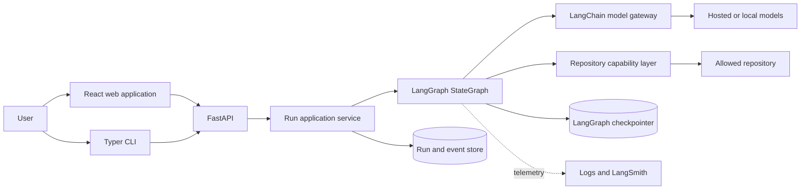
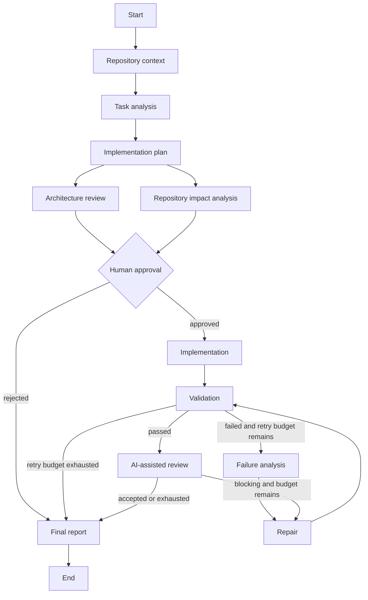
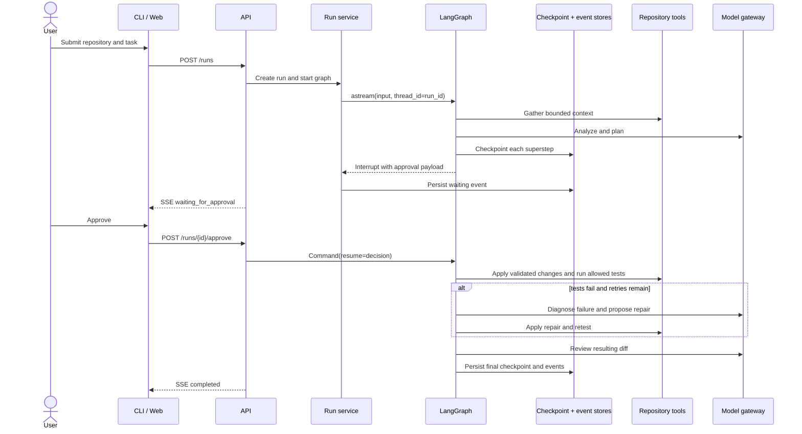

# Architecture

## System context

TaskPilot AI is a single-installation developer platform that coordinates a software change inside an explicitly allowed Git repository. It separates deterministic workflow and policy from probabilistic model behavior.

## Component boundaries

| Component | Owns | Does not own |
| --- | --- | --- |
| API | HTTP validation, lifecycle endpoints, SSE transport | Graph decisions or repository access |
| Application service | Run concurrency, graph invocation/resume, event publication | Prompt logic |
| LangGraph graph | State transitions, parallelism, interrupts, retry routing | Provider SDK details or arbitrary shell execution |
| Nodes | One engineering responsibility and typed state update | Cross-run persistence plumbing |
| Model gateway | Provider construction, structured output, usage normalization, routing | Workflow sequencing |
| Repository tools | Canonical paths, capabilities, bounded reads/writes/commands | Choosing what engineering change to make |
| Persistence | Checkpoints, run projections, append-only events | Business routing |
| Observability | Correlated logs, traces, timings, usage | Authoritative workflow state |

## Workflow

Architecture and repository-impact analysis run in the same LangGraph superstep. The join waits for both updates before entering approval. Routing functions are deterministic: they inspect typed results, approval status, and counters; they do not ask a model where the graph should go.

## State model

The graph uses a versioned `WorkflowState` schema. Nodes return partial updates rather than mutating shared objects. State areas and owners are:

| State area | Primary writer | Lifecycle |
| --- | --- | --- |
| Run/task metadata and policy snapshot | run service | Immutable after start; lifecycle status lives in the run projection |
| Repository descriptor and context manifest | context node | Replaced when context is refreshed |
| Task analysis and plan | analysis/planning nodes | Stable after approval unless explicitly revised |
| Architecture and impact findings | parallel analysis nodes | Stable after join |
| Approval request and decisions | approval node | Append-only decisions |
| Proposed/applied changes | implementation/repair nodes | Replaced per attempt; applied records append |
| Validation and diagnosis | test/diagnosis nodes | Latest result plus bounded attempt summaries |
| Retry counters | deterministic routing nodes | Monotonic and policy bounded |
| Review findings | review node | Latest structured review |
| Model decisions and usage | model gateway | Append-only bounded summaries |
| Terminal outcome | report node | Set once after deterministic outcome evaluation |

Repository context stores file metadata and hashes rather than a full source snapshot. Proposed file contents remain in the checkpoint because they are needed to resume hash-guarded writes, but the API redacts those contents and exposes byte counts instead. Validation output is bounded before entering state. A separate artifact store is intentionally deferred until the project needs long-term retention of full logs or patches.

## Execution lifecycle

## Persistence and resume

LangGraph checkpoints are authoritative for graph position and workflow state. The run store is a query-optimized projection for API status, timestamps, ownership, and terminal outcome. The event store is append-only and provides monotonic sequence numbers for replayable SSE. Public event payloads are bounded and redact file content; a separate artifact store for bulky output is future work.

Local mode uses async SQLite adapters. Production mode uses PostgreSQL implementations for LangGraph checkpoints, run projections, and the event log while retaining their logical separation. PostgreSQL event sequences are allocated under a transaction-scoped advisory lock; lifecycle transitions remain compare-and-set operations. The run ID is also the LangGraph `thread_id`. Approval resumes the same thread with `Command(resume=...)`, so duplicate approvals or competing workers cannot resume a graph twice.

The application captures file hashes before model invocation and supplies them to atomic writes; the model never owns concurrency preconditions. Event publication uses idempotency keys, and approval resume is guarded by a compare-and-set lifecycle transition. These controls do not provide exactly-once side effects: a crash inside a write-capable or command node can leave work after the last checkpoint. The current release proves restart/resume at the approval boundary; broader crash recovery requires idempotent worker operations or an external durable execution boundary.

## Model abstraction and routing

LangChain chat-model interfaces provide prompt composition, invocation, and structured output. TaskPilot adds a small `ModelGateway` around those interfaces to normalize provider construction, routing, token usage, and response errors. A configuration registry maps roles (`analyst`, `planner`, `architect`, `coder`, `reviewer`, `reporter`) to provider definitions. Repository capabilities are deliberately application-owned and are not exposed as model-selected LangChain tools.

Routing is explicit policy, not hidden model selection. Named profiles group a complete set of role assignments and ordered routing rules. The API validates an optional profile at run creation and stores the resolved name inside `WorkflowPolicy`, so the choice is checkpointed and cannot drift when an approval resumes. Each model decision records the profile, reason, provider, model, latency, and usage. Existing single-assignment configuration is normalized into a `default` profile.

The provider factory covers deterministic demo, OpenAI, Anthropic, and OpenAI-compatible endpoints. Local services can use the same compatible adapter when they implement the required chat and structured-output behavior. Credentials, organization identifiers, and custom header values are resolved from named environment variables. Static non-secret compatible-provider request fields may use bounded configuration fields such as `max_tokens` and `extra_body`. At startup, TaskPilot validates complete role coverage, model references, provider integration availability, required environment values, and the structured-model interface before accepting runs.

## Repository tool security

Repository input and model output are untrusted. Every operation resolves paths against a canonical configured repository root and rejects absolute paths, traversal, escape through symlinks, oversized input, and unsupported encodings. Capabilities are separate:

- read: list, bounded file read, literal/regex search, Git status/diff;
- write: atomic create/replace of explicitly named files with precondition hashes;
- execute: argument-vector commands matched against configured prefixes.

There is no general shell tool. Commands do not use shell interpolation, inherit only an allowlisted environment, have time and output limits, and run in the repository root. The current graph gates the combined plan before any write or command; independent write and command approval flags are reserved in policy but are not yet separate interrupts. These controls reduce accidents but are not isolation from a malicious repository; disposable containers or VMs are required for that threat model.

## Human approval

The default policy requires one approval after the plan and parallel architecture/impact analysis, before any write. The interrupt payload contains the plan, findings, intended files, proposed validation commands, risks, and policy-relevant actions. A rejection accepts an optional reason and terminates with an auditable report. Separate write and command interrupts are a documented extension point, not a current capability.

## Streaming

The graph emits typed internal events. The application service normalizes them into stable public events and persists each event before live publication. `GET /runs/{id}/events` uses Server-Sent Events because updates are server-to-client, browsers reconnect natively, and `Last-Event-ID` supports replay. Mutations such as approval and rejection remain ordinary HTTP requests; authentication is a deployment responsibility in this preview. A future `/v1` API will version the public schema before backward-incompatible changes are introduced.

## Failure recovery

Validation is deterministic: exit code, timeout, output truncation, and configured required commands determine pass or fail. A failed result enters diagnosis, then repair, then validation. The retry counter increments once per repair attempt and cannot exceed the policy snapshot. Exhaustion routes to a terminal `failed` report with the bounded final validation summary and stop reason. Unexpected node exceptions fail the run visibly and emit a typed error event; infrastructure retry classification is a future worker concern.

## Observability

Structured JSON logs bind request IDs at the HTTP boundary and run IDs around graph execution. Node start/completion/failure, normalized model decisions, repository operations, latency, token usage when reported, and terminal errors are also durable public events. LangSmith tracing is opt-in through configuration and complements rather than replaces application logs and state. Secrets and full proposed file contents are excluded from public events.

## Deployment model

Local development runs API, worker, and SQLite in one process, plus the Vite frontend. Docker Compose adds PostgreSQL and independently runnable API/web services. The first production-oriented deployment still assumes a trusted single installation. A future worker queue can claim persisted runnable runs using leases without changing graph or API contracts.

## Major tradeoffs

- **Custom API over LangGraph Agent Server:** demonstrates and controls the application lifecycle, event schema, and security boundary; requires more persistence plumbing.
- **SSE over WebSockets:** simpler replay and operations for one-way progress; interactive token-by-token bidirectional sessions are out of scope.
- **Bounded payloads before an artifact store:** fewer moving parts and complete durable resume today; very large patch/log retention will require an object-store-backed artifact boundary later.
- **In-process local worker first:** excellent developer experience and deterministic tests; horizontal execution requires the documented lease/worker evolution.
- **Allowlisted host processes:** practical for trusted development; hostile repositories require external isolation.
